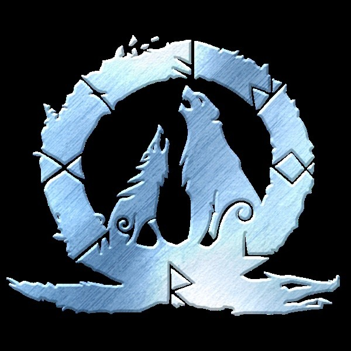
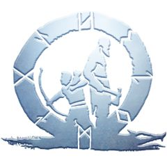
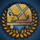
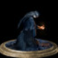
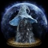
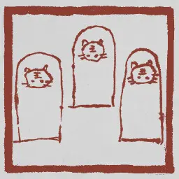

## A little bit about me

🖥️ &nbsp; Currently working on AI Compiler and Agentic System. Previously a Medical Foundation Model Researcher (see [SAM-Med3D](https://github.com/uni-medical/SAM-Med3D.git)).\
🧠 &nbsp; I'm actively learning about ML Systems 🔧, Agentic Application 🤖, AI-Powered Healthcare 🩺, and Software Architecture 🏗️.\
🎮 &nbsp; In my free time, I enjoy gaming, taking leisurely walks, and spending quality time with family.

## There's my works

## Game achievements unlocked

  
  
  
  
  
  
  
  

