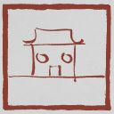

## A little bit about me

🖥️ &nbsp; Currently working on AI Compiler and Agentic System. Previously a Medical AI Researcher (see [SAM-Med3D](https://github.com/uni-medical/SAM-Med3D.git)).\
🧠 &nbsp; I'm actively learning about ML Systems 🔧, Agentic Application 🤖 and AI-Powered Healthcare 🩺.\
🎮 &nbsp; In my free time, I enjoy gaming, taking leisurely walks, and spending quality time with family.

## There's my works
### Researches

### Useful tools

### Open-Source Contributions

## Game achievements unlocked

  
  
  
  
  
  
  
  

